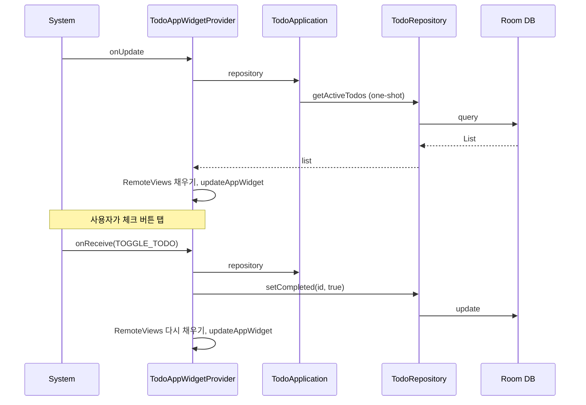

# 할 일 목록 홈 화면 위젯 구현 계획

## 현재 구조 요약

- [TodoEntity](app/src/main/java/com/naze/side_o/data/local/TodoEntity.kt): `id`, `title`, `isCompleted` 등
- [TodoRepository](app/src/main/java/com/naze/side_o/data/repository/TodoRepository.kt): `getActiveTodos(): Flow`, `setCompleted(id, completed)`
- [TodoApplication](app/src/main/java/com/naze/side_o/TodoApplication.kt): `repository` 싱글톤 제공
- 위젯 관련 코드 없음 (신규 추가)

## 구현 방향

- **RemoteViews** 기반 App Widget (Compose 미지원이므로 XML 레이아웃 + `AppWidgetProvider`).
- 위젯에서 표시할 항목 수는 **고정 N개**(예: 5~7개)로 두고, 그만큼만 레이아웃에 row를 두어 구현 단순화. (나중에 `RemoteViewsService` + 리스트로 확장 가능)
- 체크 버튼 탭 시: `PendingIntent`로 브로드캐스트 → `AppWidgetProvider`에서 `TodoApplication.repository`로 `setCompleted(id, true)` 호출 후 위젯 갱신.

---

## 1. 위젯 레이아웃 (XML)

- **경로**: `app/src/main/res/layout/widget_todo_list.xml`
- **구성**:
  - 상단: 제목용 `TextView` (예: "할 일")
  - 그 아래: 할 일 한 줄당 하나의 **row** 레이아웃을 N개 포함 (예: 5~7개)
- **Row 항목 레이아웃** (`res/layout/widget_todo_item.xml`):
  - `TextView`: 할 일 제목
  - `ImageButton` 또는 `ImageView`: 체크 버튼 (클릭 시 해당 항목 완료)
- 위젯 전체는 `LinearLayout` (vertical). 빈 슬롯은 `TextView`를 `visibility = GONE` 또는 빈 문자열로 처리.

---

## 2. 위젯 메타데이터

- **경로**: `app/src/main/res/xml/app_widget_info.xml`
- `minWidth` / `minHeight`: 2x2 또는 2x3 셀 정도 (예: 180dp x 110dp).
- `updatePeriodMillis`: 0 또는 긴 주기 (배터리 고려; 버튼 클릭 시 수동 갱신으로 보완).
- `initialLayout`: `@layout/widget_todo_list`.
- `previewImage`: 선택 사항.

---

## 3. AppWidgetProvider

- **경로**: `app/src/main/java/com/naze/side_o/widget/TodoAppWidgetProvider.kt`
- **역할**:
  - `onUpdate`: 활성 할 일 목록을 가져와서 N개 row에 채우고, 나머지 row는 숨김. 체크 버튼에 `PendingIntent` 부여 (action: `ACTION_TOGGLE_TODO`, extra: `todo_id`).
  - `onReceive`: `ACTION_TOGGLE_TODO` 수신 시 `todo_id`로 `(application as TodoApplication).repository`에서 `setCompleted(id, true)` 호출 후 위젯 갱신.
- **주의**: `getActiveTodos()`는 `Flow`이므로 `first()` 또는 `flow.first()`로 한 번만 가져오기. 호출은 코루틴에서 해야 하므로 `TodoApplication`에 `ApplicationScope`(또는 `CoroutineScope`)를 두고, `onReceive`/`onUpdate`에서 해당 스코프로 `launch` 후 DB 접근 및 `appWidgetManager.updateAppWidget` 호출.

---

## 4. Application에 코루틴 스코프 추가

- [TodoApplication.kt](app/src/main/java/com/naze/side_o/TodoApplication.kt)에 `CoroutineScope(SupervisorJob() + Dispatchers.Default)` (또는 `Dispatchers.Main.immediate`로 UI 갱신 시 메인 전환) 추가.
- 위젯 Provider에서 `(applicationContext.application as TodoApplication).scope.launch { ... }` 형태로 DB 접근 및 업데이트 수행.

---

## 5. 매니페스트 및 리시버 등록

- [AndroidManifest.xml](app/src/main/AndroidManifest.xml)에 `<receiver>` 추가:
  - `android:name=".widget.TodoAppWidgetProvider"`
  - `android:exported="true"`
  - `intent-filter`: `ACTION_APPWIDGET_UPDATE`
  - `meta-data`: `android:resource="@xml/app_widget_info"`, `name="android.appwidget.provider"`
  - 커스텀 액션 `ACTION_TOGGLE_TODO`도 같은 리시버에서 처리하려면 `intent-filter`에 `<action android:name="...TOGGLE_TODO" />` 추가 (또는 동적 PendingIntent로 전달만 하고 기본 `onReceive`에서 처리).

---

## 6. 문자열/리소스

- [strings.xml](app/src/main/res/values/strings.xml): 위젯 제목(예: `widget_title`), 필요 시 "할 일 없음" 등.
- 체크 버튼용 아이콘: 기존 앱의 체크 아이콘 리소스가 있으면 재사용, 없으면 `res/drawable`에 간단한 체크 아이콘 추가 (또는 `@android:drawable` 활용).

---

## 7. (선택) 앱 내에서 위젯 추가 유도

- 설정 화면 등에 "홈 화면에 위젯 추가" 안내 또는 `AppWidgetManager.requestPinAppWidget` 호출 버튼을 두면 사용성이 좋아짐. 범위 내에서만 구현 가능.

---

## 파일 변경/추가 목록

| 구분  | 파일                                       |
| --- | ---------------------------------------- |
| 신규  | `res/layout/widget_todo_list.xml`        |
| 신규  | `res/layout/widget_todo_item.xml`        |
| 신규  | `res/xml/app_widget_info.xml`            |
| 신규  | `widget/TodoAppWidgetProvider.kt`        |
| 수정  | `TodoApplication.kt` (CoroutineScope 추가) |
| 수정  | `AndroidManifest.xml` (receiver 등록)      |
| 수정  | `res/values/strings.xml` (위젯용 문자열, 필요 시) |

---

## 참고

- 위젯 UI는 RemoteViews 제한으로 인해 Compose 사용 불가.
- 할 일이 N개를 넘으면 위젯에는 상위 N개만 표시. 전체 목록은 앱 실행으로 확인하도록 안내 가능.
- 나중에 `RemoteViewsService` + `ListView`/`StackView`를 쓰면 스크롤 가능한 긴 목록으로 확장할 수 있음.

